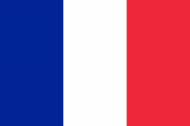

<h2>We are recruiting 120 participants for an online study that observes how younger and older adults perform various memory tasks. </h2>

<table border="0"> 
	<tr style="vertical-align:top">
		<td>
			
<b>Study Procedure</b>

			One <b>online</b> session including:
			<ul>
				<li>Informed consent</li>
				<li>Performance of memory and cognitive tasks</li>
				<li>Complete questionnaires</li>
			</ul>
		</td>
		<td>
			
<b>Eligibility Criteria</b>

			<ul>
				<li>Age 18-30 OR 60+ years</li>
				<li>Normal or correct-to-normal hearing and vision</li>
				<li>No neurological disorders</li>
				<li>Computer/laptop with microphone and speakers</li>
				<li>Need to use Chrome webbrowser</li>
			</ul>
			
<b>Compensation</b>

			<ul>
				<li>Entry into a raffle to win one of two $50 gift cards</li>
			</ul>
		</td>
	</tr>
</table>

	<a href="https://jatos.ncmlab.ca/publix/TL1DU7CIL5r?Battery=11"><h2>Participate in English</h2></a> (This link will take you directly to the task which will take between 30 and 45 minutes to complete.)

<h2>Nous recrutons 120 participants pour une étude en ligne qui observe comment les adultes effectuent diverses tâches de mémoire. </h2>

<table border="0"> 
	<tr style="vertical-align:top">
		<td>
			
<b>Procédures pour cette étude</b>

			Une session de 60 minutes y comprise :
			<ul>
				<li>Consentement éclairé.</li>
				<li>Effectuer les tâches de mémoire et les tâches cognitives.</li>
				<li>Remplir les questionnaires.</li>
			</ul>
		</td>
		<td>
			
<b>Critères d'éligibilité</b>

			<ul>
				<li>A&#770;gés de 18 à 30 ans ou de 60 ans et plus.</li>
				<li>Audition et vision normales ou correctes à normales</li>
				<li>Pas de troubles neurologiques</li>
				<li>Ordinateur/ordinateur portable avec microphone et haut-parleurs</li>
			</ul>
			
<b>Compensation</b>

			<ul>
				<li>Participation à une tombola pour gagner l’une des deux cartes-cadeaux de 50 $.</li>
			</ul>
		</td>
	</tr>
</table>

	<h2>Participer en Français</h2>(lien non actif)

