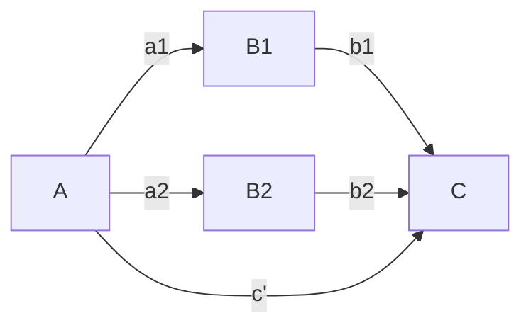

# Parallel mediation
Permanent Note
Created: 01-07-2022 10:59

I think this model also needs a link between B1 and B2. I need to check on that though.

$B_1 = \beta_0 + a_1 \cdot A + e_i$
$B_2 = \beta_0 + a_2 \cdot A + e_i$
$C=\beta_0 + c' \cdot A + b_1 \cdot B1 + b_2 \cdot B2 + e_i$

The pathways are 
$a_1 \cdot b_1$
$a_2 \cdot b_2$

## References
1. 