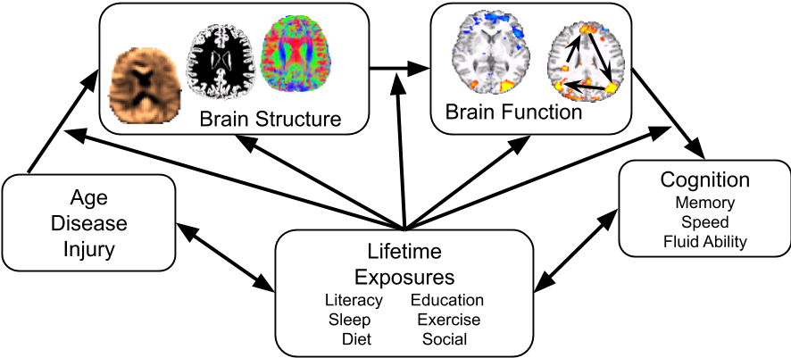

---
#
# By default, content added below the "---" mark will appear in the home page
# between the top bar and the list of recent posts.
# To change the home page layout, edit the _layouts/home.html file.
# See: https://jekyllrb.com/docs/themes/#overriding-theme-defaults
#
layout: home
---

The goals of the Neural Cognitive Mapping laboratory are to understand <i><b>how and why</b></i> cognition declines with advanced age in some, but not all, people. 

Some people live long, cognitively healthy lives even when their brain is experiencing age or disease related neural decline. Such people are described as having cognitive reserve or the ability to maintain healthy cognitive functioning despite the neural declines.

This lab acheives its goals by integrating people and skills of different disciplines including: neuroimaging, neuropsychology, statistical modeling, mathematical model, advanced computing and coding. 

If you are interested in working with us as a participant or a researcher please see our [projects page](projects/).

Learn more about the lab [here.](about/)

